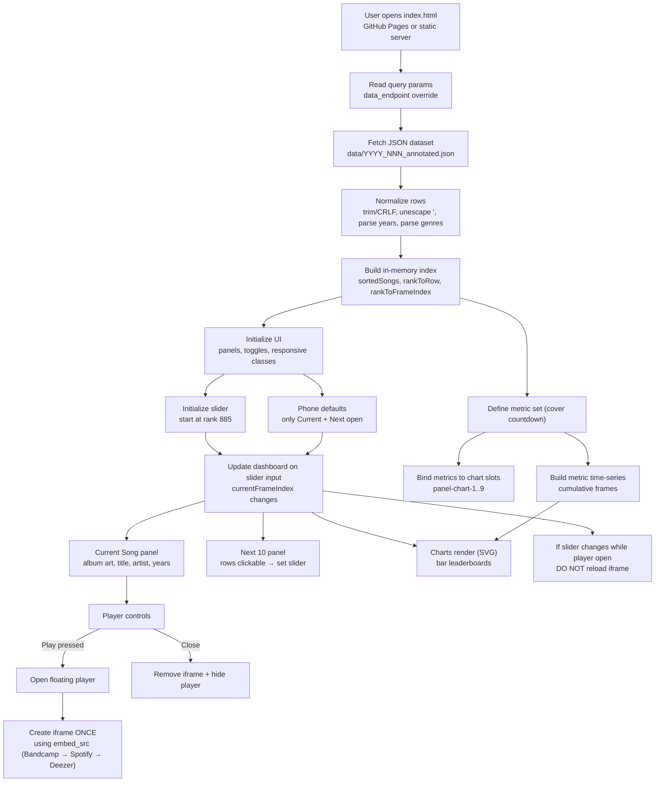

# Architecture

Each dashboard is a **single-file, self-contained HTML app** that loads a JSON dataset and renders:
- a “Current Song” panel
- a “Next 10 Songs” navigation panel
- multiple SVG leaderboard charts
- an on-demand, floating embedded preview player (Spotify/Deezer/Bandcamp when available)

The design supports **mobile usability**, prioritizes **stable UI**, and **rate-limit-safe embeds**.

---

## System overview

---

## Key invariants

These are intentional “rules” the implementation relies on.

### Embedded player is created only on Play
- The iframe is **never created or reloaded** during slider changes.
- If the floating player is open and the slider changes, the player continues playing the previously selected song.
- The embed changes only when the user presses **Play** again (or closes and reopens).

**Why:** prevents Spotify/Deezer 429 rate limiting caused by rapid embed reloads.

### Metric category keys are always strings
- All metric category keys are canonicalized to **strings** during counting.
- This prevents subtle mismatches between:
  - `Set` membership (type-sensitive)
  - object snapshot keys (always strings)

**Why:** avoids “empty charts” due to numeric vs string key mismatches, especially for years/decades.

### Chart panels are slots, not meanings
- Chart containers are generic slots (`panel-chart-1..9`).
- Metric meaning is assigned in JavaScript (title, category function, thresholds).

**Why:** allows future countdown variants to swap metric sets without restructuring the DOM.

### Normalization happens once, centrally
During load:
- trims whitespace and CR/LF
- unescapes PHP-style apostrophes (`You\'ve` → `You've`)
- parses years robustly from strings or numbers
- parses PHP-serialized genre arrays (e.g., `a:4:{...}`); `a:0:{}` becomes “no genres”

**Why:** ensures consistent display and correct aggregation.

---

## Major components

### Data load & normalization
- Fetch JSON from the default path or `?data_endpoint=...`
- Normalize all fields used for display and metrics
- Build quick-lookup maps for rank navigation

### State & navigation
- Slider controls a single state variable: `currentFrameIndex`
- Most UI updates are derived from that index:
  - current song panel
  - next 10 window
  - chart frame selection

### Metrics & charts
- Each metric defines:
  - `key`, `title`, `topN`, `minFinal`, `categoryFn`
- Metrics are precomputed into cumulative “frames” so chart updates are fast
- Charts are rendered as SVG horizontal bars with axis ticks and tooltips

### Floating player
- Provider preference order:
  1) Bandcamp (manual overrides)
  2) Spotify
  3) Deezer
- Close removes the iframe (stops playback)

---

## Extending to other countdowns

To reuse this dashboard for non-cover countdowns:
- keep the same shell (panels, chart slots, player behavior)
- swap the metric set (e.g., “Most Frequent Albums”, “Most Frequent Decades”)
- adjust Current panel phrasing when `originalArtist/originalYear` are absent

The architecture is designed so these changes stay **configuration-driven**, not structural.
